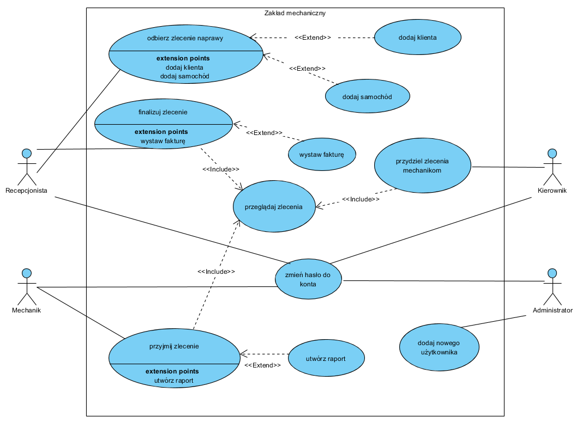

# Zakład mechaniczny

**Spis treści**

 1. [Opis](#opis)
 2. [Instalacja](#Instalacja)
 3. [Sposób użycia](#sposób-użycia)
 4. [Preferencje do współpracy](#preferencje-do-współpracy)
 5. [Autorzy](#autorzy)
 6. [Informacja o licencji](#informacja-o-licencji)
 
 
## Opis
    Aplikacja umożliwiająca zarządzanie zakładem mechanicznym.
    System ma służyć do gromadzenia i zarządzania danymi o klientach
    oraz historii napraw posiadanych przez nich samochodów.
    System również zakłada możliwość rozdzielania zleceń przez kierownika zakładu.

    Historia naprawy ułatwia mechanikowi rozpoznanie oraz naprawę samochodu.
    Dostęp do bazy klientów usprawnia i przyśpiesza obsługę stałych klientów.
    Możliwość przydzielania zleceń mechanikom przez przełożonego przy pomocy
    systemu pozwala lepiej dysponować zasobami ludzkimi.

    System jest przeznaczony dla czterech typów pracowników:

    - Recepcjonista
    - Mechanik
    - Kierownik
    - Administrator

    Każdy z nich ma unikalne prawa dostępu wypisane poniżej:
    
        1.	Administrator
            • Zakładanie kont użytkowników
        2.	Mechanik
            • Akceptacji wykonania napraw (usług)
            • Tworzenie raportu z napraw (co zostało naprawione)
        3.	Recepcjonista
            • Dodanie klienta
            • Dodanie samochodu
            • Przypisywanie samochodu do klienta
            • Przyjęcie zlecenia
            • Finalizacja zlecenia 
            • Wystawianie faktur
        4.	Kierownik
            • Przypisywanie zadań mechanikom
    
    Gromadzone dane na temat klientów oraz samochodów są wprowadzana przez recepcjonistę.
    Zakładamy, że klient chcący oddać samochód do naprawy może posiadać wiele samochodów.
    Dane pracowników (mechanik, recepcjonista, kierownik) są inicjowane przez administratora.
    
    Recepcjonista na życzenie klienta może wygenerować fakturę. Dane do faktury mają być
    uzupełnione automatycznie.

    
    Zlecenie naprawy może przyjąć 4 stany: 
        1. Oczekujące na serwis
        2. W trakcie naprawy
        3. Gotowy do obioru
        4. Zakończone

### Diagram przypadków użycia

    
## Instalacja
    Instalacja jest wykonywana przez instalator. 
    Szczegóły pojawią się w późniejszej fazie projektu.
## Sposób użycia
    Aby stworzyć zlecenie Recepcjonista klika przycisk "Dodaj zlecenie".
    
    W przypadku nowego klienta, recepcjonista naciska przycisk "Dodaj klienta" po czym wypełnia dane klienta po czym wprowadza dane samochodu.
    W przypadku klienta, który jest juz w bazie danych recepcjonista może dodać nowy samochód lub wybrać z listy samochód już posiadany przez klienta.
    
    Podczas dodawania zlecenia recepcjonista wprowadza opis usterki natomiast dane klienta oraz samochodu są autouzupełniane przez system.
    
    Po wypełnieniu i zatwierdzeniu zgłoszenia zostaje ono dodane do kolejki oczekujących na serwis.
    
    Kierwonik widzi listę oczekujących zgłoszeń i przypisuje je kolejno mechanikom na określony dzień oraz godzinę.
    
    Mechanik zaznacza, że rozpoczyna naprawdę (przyjmuje zgłoszenie). Po wykonanej pracy tworzy raport z naprawy oraz zmienia stan na gotowy do odbioru.
    Raport zawiera liste wymienionych części, wykonanych napraw oraz cenę za usługę.
    
    Recepcjonista posiada liste ze statusem napraw samochodów i może rozliczać pojazdy, po czym zmienia stan na "Zlecenie zakończone".
    Klientowi może zostać wystawiona faktura VAT.
    

## Preferencje do współpracy
    Kontakt mailowy na adres: filiprebizant@gmail.com
    
## Autorzy
    Filip Rebizant
    Bartłomiej Kudełka
    Konrad Rejman
    Wojciech Olech
    Marek Wojdyła
     
## Informacja o licencji    
    Kod źródłowy jest objęty licencją MIT.
