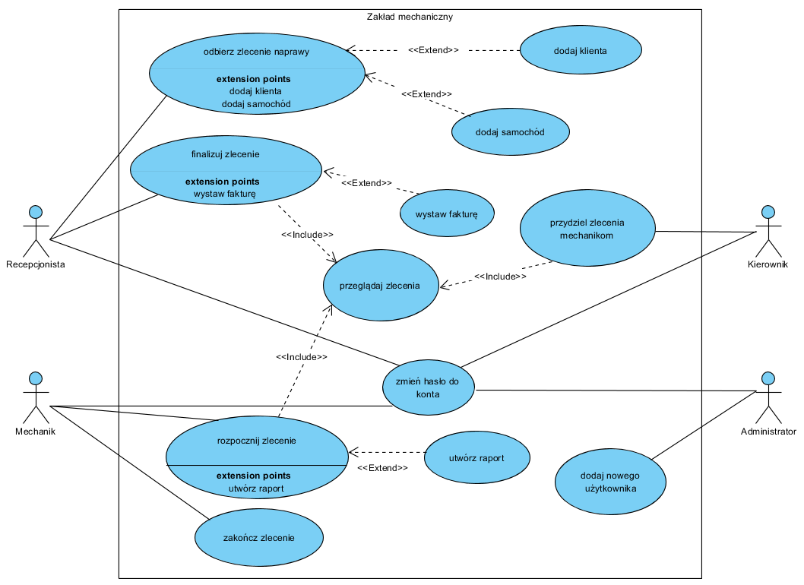

# Zakład mechaniczny

**Spis treści**

 1. [Opis](README.md#opis)
 2. [Instalacja](README.md#Instalacja)
 3. [Sposób użycia](README.md#sposb-uycia)
 4. [Preferencje do współpracy](README.md#preferencje-do-wsppracy)
 5. [Autorzy](README.md#autorzy)
 6. [Informacja o licencji](README.md#informacja-o-licencji)
 
 
##Opis
    Aplikacja umożliwiająca zarządzanie zakładem mechanicznym.
    
    Wyróżniamy 4 rodzaje dostępu użytkowników: admnistrator, mechanik, kieronik, recepcjonista.
    Każdy z nich ma unikalne prawa dostępu wypisane poniżej:
    
        1.	Administrator
            • Zakładanie kont użytkowników
        2.	Mechanik
            • Akceptacji wykonania naprawy (usługi)
            • Tworzenie raportu z naprawy (co zostało naprawione)
        3.	Recepcjonista
            • Dodanie klienta
            • Przypisywanie samochodów do klienta
            • Przyjęcie zlecenia
            • Finalizacja zlecenia 
            • Wystawianiu faktury
        4.	Kierownik
            • Przypisywaniu zadań mechanikom
    
### Diagram przypadków użycia

    
## Instalacja

## Sposób użycia

## Preferencje do współpracy
    Kontakt mailowy na adres: filiprebizant@gmail.com
    
## Autorzy
    Filip Rebizant
    Bartłomiej Kudełka
    Konrad Rejman
    Wojciech Olech
    Marek Wojdyła
     
## Informacja o licencji    
    Kod źródłowy jest objęty licencją MIT.